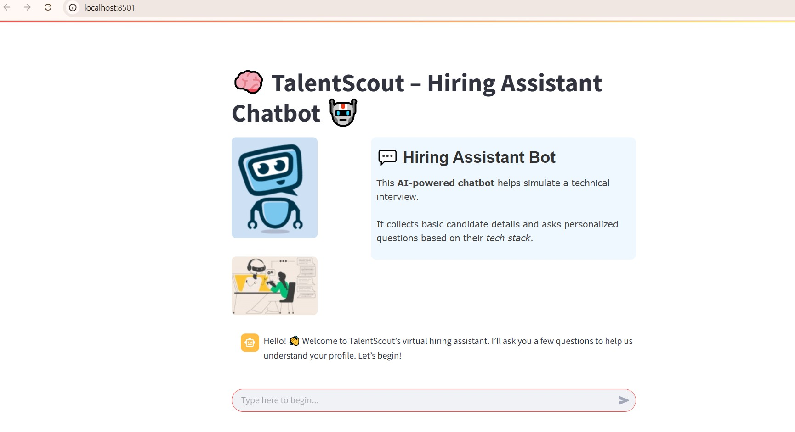
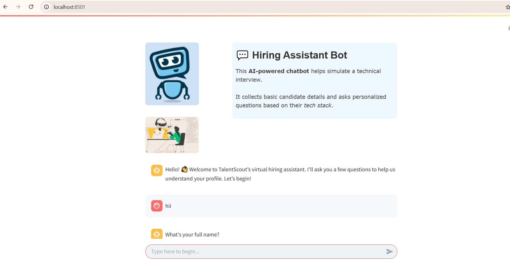
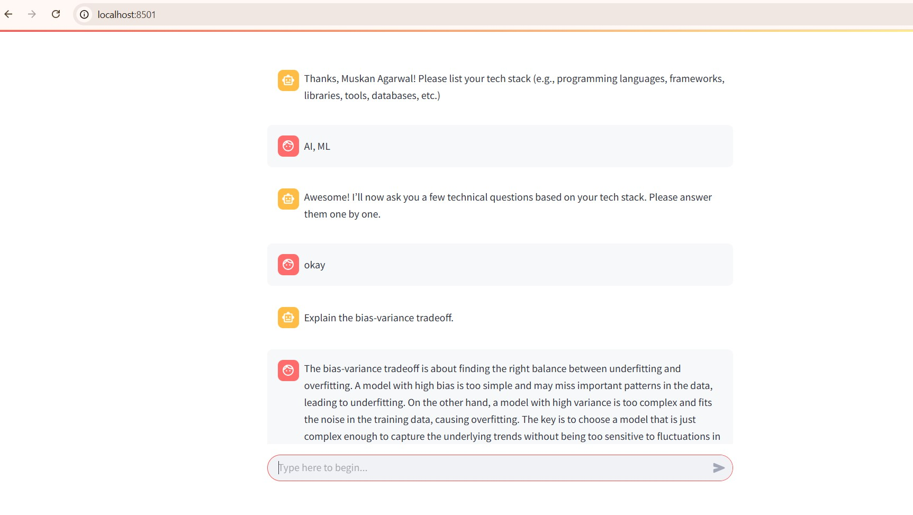

# 🧠 TalentScout- Hiring Assistant Chatbot 🤖

Imagine an HR assistant that never sleeps, never forgets, and always asks the right questions.
Meet **TalentScout** — your AI-powered interviewer built with 💖, powered by Gemini, and deployed with Streamlit.

From "What's your tech stack?" to "Can you explain polymorphism?", this chatbot handles candidate screening like a pro — no coffee breaks needed!


## 🎯 Project Overview

**TalentScout** is a conversational chatbot that conducts **smart, structured pre-interview screenings**.
It collects candidate details and asks **context-aware technical questions** based on the candidate’s tech stack. Ideal for startups and hiring managers looking to streamline the first round of interviews.


## 🛠️ Features

✅ Friendly onboarding experience. Greets candidates like a pro  
✅ Gathers essential candidate info (full name, contact, experience, location, desired role, and tech stack.)  
✅ Dynamically generates 3–5 technical questions using **Gemini**  
✅ Remembers what was asked (and what was answered!)  
✅ Knows when to say goodbye – ends the chat gracefully, like a true professional    
✅ Styled with custom visuals. Stays cool under pressure – fallback mechanism handles unexpected answers like a smooth operator  
✅ 💬 Local Streamlit interface — no cloud deployment required  







## ⚙️ Installation Instructions

1. **Clone the Repo**

   ```bash
   git clone https://github.com/your-username/talentscout-chatbot.git
   cd talentscout-chatbot
   ```

2. **Set Up Virtual Environment** (Optional but recommended)

   ```bash
   python -m venv venv
   source venv/bin/activate  # Windows: venv\Scripts\activate
   ```

3. **Install Dependencies**

   ```bash
   pip install -r requirements.txt
   ```

4. **Add Gemini API Key**
   Create a `.env` file in the root directory:

   ```
   GEMINI_API_KEY=your_gemini_api_key_here
   ```

5. **Run the Chatbot**

   ```bash
   streamlit run app.py
   ```

6. Open your browser to:
   `http://localhost:8501`
   
Boom 💥 – you're live!


## 💡 How It Works

1. **Greeting Stage** – Welcomes the user warmly.
2. **Information Gathering** – Asks basic questions: name, email, experience, tech stack, etc.
3. **Question Mode** – Based on the tech stack, the bot asks 3–5 **intelligent technical questions**.
4. **Auto-Wraps Up** – After the last question, it thanks the candidate and ends the chat.


## 🧠 Under the Hood

### 🔧 Libraries Used

* `streamlit` – clean UI for chat interaction
* `google.generativeai` – Gemini API for intelligent question generation
* `dotenv` – for API key management
* `Python 3.10+` – classic, reliable, and powerful

### 🏠 Architecture

* Modular `ConversationState` class to manage state
* Streamlit’s `session_state` to preserve chat flow
* Prompt templates used to communicate with Gemini model


## 🧠 Project Structure

```bash
📁 talentscout-chatbot/
├── app.py               # Main Streamlit interface
├── prompts.py           # All the clever prompt templates
├── conversation_state.py             # Core chatbot logic
├── utils.py             # Context & fallback handling
├── requirements.txt     # Python dependencies
└── README.md            # You're here!
```


## ✍️ Prompt Design

* **Modular prompts** for each interaction stage
* **Dynamic tech question generation** using few-shot prompting
* **Memory-aware** prompts for multi-turn context
* **Graceful fallback** prompts when things get weird

> "The right prompt can turn an LLM into a genius."

We don’t just ask questions — we **craft** them:

### ➔ First Question Prompt

```text
You are interviewing a candidate for {tech_stack} skills.
Ask the first technical question.
Ask only one question with no additional description.
```

### ➔ Follow-up Prompt with Context

```text
You are interviewing a candidate for {tech_stack} skills.

Previously asked questions and candidate answers:
{history}

Please ask the next most relevant technical question.
Ask only one question with no other description.
Ask a total of 3–5 questions only based on tech stack. Dont repeat anything.
Do not include any explanations, context, or follow-up text—just output the question clearly.
```

This prompt ensures Gemini acts as an intelligent, progressive interviewer, asking one relevant question at a time.


## 🔧 Sample Prompt Logic (Spoiler Alert)

```
Prompt: "The candidate has listed Python and Django. Generate 3-5 technical questions testing their knowledge in these technologies."

Output:
1. What are Python decorators and how do you use them?
2. How does Django's ORM work under the hood?
...
```


## 🛡️ Data Privacy & Ethics (Because We Care)

* **Simulated / Anonymized Data Only** – No real user data is stored.
* Fully compliant with data privacy best practices.
* Local-only storage — nothing leaves your machine.
* Sensitive info is kept in memory – not saved, not shared.


## 🚧 Challenges & Clever Fixes

| Problem                                 | Smart Fix                                                      |
| --------------------------------------- | -------------------------------------------------------------- |
| Gemini generating all questions at once | Prompt constrained to "Ask only one question"                  |
| Managing multi-turn logic               | `ConversationState` with question/answer history               |
| Ending after 5 questions                | Introduced counter and conditional logic                       |
| Streamlit session refresh issues        | Used `st.session_state` and clean message buffering            |
| Handling user exits                     | Added graceful exit detection with keywords like `bye`, `exit` |


## 💼 Demo Ready

Just hit `streamlit run app.py` and walk through a hiring conversation like magic. Add personal branding, images, and tweak the prompt to match your tone.


## ✨ Final Words

TalentScout is not just a chatbot – it's your quirky, ever-prepared, coffee-free HR sidekick.

> "Because in the world of tech hiring, first impressions (and first questions) matter."


## 💎 Made with passion by Muskan Agarwal

Your personal AI recruiter. Interview smarter, not harder.


Happy Hiring! ✨


